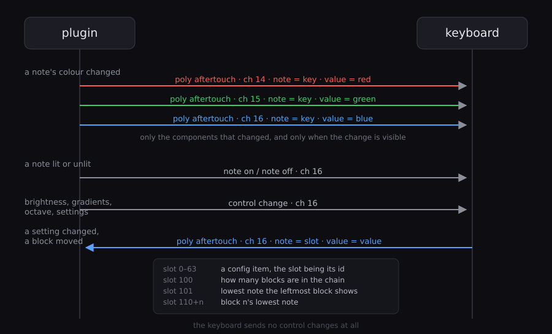

Gives every MIDI note its own colour on a ROLI LUMI Keys, from inside your DAW.

The factory firmware offers two colours and a scale mask. LumiPaint replaces the program
running on the keyboard with one that holds a full 128-entry colour table, then drives it
from a CLAP plugin: paint notes by hand, generate a scale, animate them, or read the
colours straight off another plugin's on-screen keyboard and mirror them onto the
hardware.

Two halves, and you need both:

- **`device/lumi_paint.littlefoot`** runs on the keyboard. It owns the LEDs, holds the
  colour table, and sends MIDI from the keys. Flashing it **replaces ROLI's program**;
  Dashboard's factory reset puts theirs back.
- **`src/`** builds the plugin. It decides what colour every note should be and keeps the
  keyboard in step.

---


**Contents** — [What it runs on](#what-it-runs-on) · [Setting it up](#setting-it-up) ·
[The editor](#the-editor-control-by-control) · [Several instances](#several-instances) ·
[Chained blocks](#chained-blocks-joined-or-independent) ·
[The wire protocol](#the-wire-protocol) · [Porting](#porting) · [Known limitations](#known-limitations)

---

> **Flashing the device program replaces ROLI's own.** Your keyboard will stop
> behaving the way Dashboard expects until you load a factory program back onto it.
> Dashboard's factory reset does that. Nothing here is permanent, but do not flash a
> keyboard you are about to rely on in front of people.

## What it runs on

Tested on **LUMI Keys** and **Piano M**, single and chained in pairs. Firmware 1.3.0 or
later, which is what Dashboard needs to accept a Littlefoot program at all.

Larger ROLI pianos are untested. **How to test on larger ROLI pianos** below says what
would need changing and how to find out in one flash.

## Setting it up

The quickest way in is the [latest release](../../releases/latest), which has both plugin
formats built for Windows and the device program, so nothing needs compiling.

Unzip the whole thing into a folder and double-click **`install-windows.bat`**. It copies
both plugin formats into your per-user plugin folders — no administrator prompt, because
those locations belong to you and every host scans them.

`uninstall-windows.bat` removes them again.

If you would rather do it by hand:

| File | Where it goes |
| --- | --- |
| `LumiPaint.clap` | `%LOCALAPPDATA%\Programs\Common\CLAP\` |
| `LumiPaint.vst3` | `%LOCALAPPDATA%\Programs\Common\VST3\` |
| `lumi_paint.littlefoot` | not installed — dragged onto the keyboard in ROLI Dashboard, see below |

`LumiPaint.vst3` is a **folder**, not a file. Copy the whole thing, and if your host does
not list it, check that `LumiPaint.vst3\Contents\x86_64-win\LumiPaint.vst3` is inside —
a copy that missed the nested file leaves a bundle that looks right and cannot load.

Rescan plugins in your host afterwards.

Then follow the steps below. **Step 2** is building from source and is the only one you
can skip; the keyboard still has to be flashed before any of this does anything.

**0. Check the firmware.** The keyboard needs **1.3.0 or later** for Dashboard to accept
a Littlefoot program at all. Dashboard shows the current version and updates it. On
older firmware the drop is refused or silently does nothing, and no amount of fiddling
with the program will change that.

**1. Flash the keyboard.** Open ROLI Dashboard and drag `device/lumi_paint.littlefoot` onto
the picture of your keyboard. Dashboard can stay open afterwards — it and the plugin can
hold the port at the same time.

You should see a dim rainbow across the keys straight away. That is the program's default
map, and it means the flash worked.

### Building it yourself

**2. Build the plugin.**

#### Windows

**This is the tested path.** It uses MSYS2, which provides the compiler and the shell.

**Install MSYS2** from [msys2.org](https://www.msys2.org) and run it once to let it
update itself.

**Open the right shell.** MSYS2 installs several, and they are not interchangeable: from
the Start menu choose **MSYS2 MinGW 64-bit**, not *MSYS2 MSYS*. In the wrong one the
compiler is on the path but cannot run, and the error it produces says nothing useful —
a failed compile with no compiler message at all.

**Install what is needed**, in that shell:

```sh
pacman -S --needed mingw-w64-x86_64-toolchain mingw-w64-x86_64-cmake \
                   mingw-w64-x86_64-ninja mingw-w64-x86_64-make git
```

The toolchain is the compiler. CMake, Ninja and Make are for the VST3 step, which hands
over to [clap-wrapper](https://github.com/free-audio/clap-wrapper); the build tries each
generator in turn, so having more than one is deliberate. Git fetches the dependencies.

**Fetch the dependencies and build**, from the project folder:

```sh
git clone --depth 1 https://github.com/free-audio/clap.git clap-src
git clone --depth 1 -b v1.91.5 https://github.com/ocornut/imgui.git imgui
git clone --depth 1 -b 6.0.0 https://github.com/thestk/rtmidi.git rtmidi
sh build_gui.sh
```

That builds the CLAP and then the VST3, so the two cannot drift apart. The VST3 comes
from clap-wrapper rather than a second implementation; its first run also downloads the
VST3 SDK and needs a network, and takes a few minutes.
`LUMIPAINT_NO_VST3=1 sh build_gui.sh` skips it when you are iterating on the CLAP.

**Install them:**

```sh
cp LumiPaint.clap "$LOCALAPPDATA/Programs/Common/CLAP/"
cp -r build-vst3/Release/LumiPaint.vst3 "$LOCALAPPDATA/Programs/Common/VST3/"
```

The VST3 is a folder rather than a file, hence `-r`. That is the same per-user location
`install-windows.bat` writes to, so neither path needs an elevated shell.

**Keep the project path free of spaces.** The wrapper build does not handle them and the
script refuses early rather than failing obscurely later.

#### macOS and Linux

Both use CMake, and both are untested — the code compiles and links, but has never been
run against a real host or a real keyboard. See *Known limitations* for what that covers.

macOS:

```sh
cmake -B build
cmake --build build
cp -r build/LumiPaint.clap ~/Library/Audio/Plug-Ins/CLAP/
```

`LUMIPAINT_HOST_SOURCES` no longer needs spelling out — each platform has one sensible
answer and CMake picks it. The result is a bundle, not a file, hence `cp -r`. Universal
by default; `-DCMAKE_OSX_ARCHITECTURES=arm64` builds for Apple silicon alone.

Linux:

```sh
cmake -B build -DCMAKE_BUILD_TYPE=Release
cmake --build build
cp build/LumiPaint.clap ~/.clap/
```

Linux needs `libx11-dev`, `libgl1-mesa-dev` and `libasound2-dev`, and X11 — under a
native Wayland session the editor will not embed and the capture cannot work at all,
since one client reading another's surface is what Wayland exists to prevent. XWayland
is fine. File dialogs use `zenity` or `kdialog` if either is installed; without one, maps
have to be loaded by path.

On macOS, reading another application's window needs Screen Recording permission, granted
once in System Settings. The first attempt fails and the system prompts, and the host has
to be restarted before it takes effect.

Add `-DLUMIPAINT_BUILD_VST3=ON` to either for a VST3, and on macOS an AU as well. Those
come from [clap-wrapper](https://github.com/free-audio/clap-wrapper), which turns the
finished CLAP into the other formats — so one set of sources serves all of them and a
fix cannot land in one and miss another.

### In your DAW

**3. Load LumiPaint on a track**, before the instrument. It is a note effect: notes pass through
untouched, and sitting ahead of the instrument is what lets the capture feature play a
note into the plugin it is reading.

**4. Choose the keyboard** in the combo at the top of the editor. `Auto` takes the first port
whose name looks like a ROLI keyboard — LUMI, Piano M, or anything with ROLI in it —
which is wrong the moment you own two, so pick yours explicitly. The choice is saved with the project.

If the keys look black, raise **Unlit level** — it defaults low so that played notes stand
out, which is too dark for looking at a static map.

---

## The editor, control by control

### Top bar

| Control | What it does |
| --- | --- |
| Port combo | Which MIDI output is your keyboard. `Auto` takes the first port whose name looks like a ROLI keyboard — LUMI, Piano M, or anything with ROLI in it, matched without regard to case. Stored by name, not index, so adding another device does not repoint it. |
| `Hold` | Keeps the keyboard on this instance instead of letting whichever track you play take it. See *Several instances*. |
| `Key width` | How wide the on-screen keys are drawn. Display only. |
| `Range` | Which notes the on-screen keyboard shows. Display only — the hardware window is marked by the green bracket beneath. |

The keyboard drawing shows the composited result, animations included, so it is a live
preview of the hardware. Keys outside the bracket are dimmed: no connected block can show
them.

### Colour

Paint the 128-note table by hand.

| Control | What it does |
| --- | --- |
| Picker | The colour everything in this section applies. |
| `Single note` / `All octaves` | Whether clicking a key selects just it or every octave of that pitch class. |
| Note field, `Set this note` | Colour one note by number, without hunting for it on screen. |
| `Apply to selection` | Paint the picker colour onto the selected notes. |
| `Pick from selection` | Load the first selected note's colour back into the picker. |
| `Fill unselected` | Paint everything *except* the selection. One note red and the other 127 blue is two clicks. |
| `Invert selection`, `Select all`, `Select none` | Selection. |
| `Save map...` / `Load map...` | Saves the whole look of an instance to a file: the 128 note colours, every effect colour, and the settings that go with them — which effects are on, ripple speed and trail and colour source, afterglow decay, degree and tension strength, the waves delay, brightness and unlit level. Not the port, the octave or anything else particular to this keyboard on this day, so a map opens the same on someone else's chain. Readable text, saved wherever you like; the dialog starts in Documents/LumiPaint but nothing depends on that. |

Alt-drag across the on-screen keyboard paints directly. Shift-click extends a selection,
ctrl-click toggles one note.

### Modes

Four ways to fill the whole colour table at once. Each overwrites everything, so run one
first and paint individual notes afterwards.

| Mode | What it does |
| --- | --- |
| `Chromatic wheel` | Hue by pitch class, so every C is one colour and every F# another. |
| `Circle of fifths` | Hue by position in the circle, so harmonically related keys sit near each other. |
| `Piano` | White keys white, black keys off. |
| `Blackout` | Everything off, as a starting point for painting by hand. |

Below them is the scale, which is a different thing: it colours the table by a key rather
than by a pattern, and it is also what Degrees and Tension measure against.

| Control | What it does |
| --- | --- |
| `Root` / `Scale` | The key. 63 scales in 8 groups; changing either recolours immediately. |
| Root / In / Out swatches | The three colours a scale uses: the tonic, the notes in the scale, the notes outside it. |
| `Reapply` | Repaint with the current scale and colours, after changing a swatch. |
| `Select in-scale` | Select the notes of the scale instead of painting them, so you can then paint them yourself with anything from the Colour section. |

### Lighting

| Control | What it does |
| --- | --- |
| `Brightness` | Overall LED brightness. |
| `Unlit level` | How bright a key is when nothing is happening on it. Low values make played notes stand out; raise it to read a static map. |
| `Send rate` | How hard to drive the link. `automatic` follows how many blocks are connected: one block is on USB and takes a hard drive, a chain has to feed its second block over the relay. Raise it by hand if your chain copes. |

### Sounding notes

What a key looks like while it is playing.

| Control | What it does |
| --- | --- |
| `Incoming` | Notes arriving from the DAW use this colour rather than their own. |
| `Pressed` | Keys you are physically holding use this colour. Wins over `Incoming`, so a played note still reads over a busy sequence. |
| `Pressure` | Blends toward this colour as you press harder. |
| `Bend` | Blends toward this colour as a note bends, and lifts the key past the brightness ceiling so bend is brighter than everything else. |
| `Bend full-scale` | How much bend counts as maximum, in units of 64. A LUMI key bends about 170 units of the 14-bit range, so the default of 2 saturates on a full slide. Lower is more sensitive. |

### Auto-detection of coloured keys in a plugin

Read another plugin's on-screen keyboard and copy its colours onto the hardware.

This is what it was built for. **Kontakt** and **Falcon** colour their keyboards to show
what the keys do — keyswitches, articulations, drum maps, mapped ranges — and that
information lives inside the plugin window with nowhere else to go. Reading it puts those
same colours under your fingers, so you can see where the articulations are without
looking at the screen. Also works with DecentSampler, SINE Player and Chromaphone.

Little use on a plugin that draws a plain piano: there is nothing to copy.

| Control | What it does |
| --- | --- |
| `Find windows` | List what is open. |
| `Read keyboard` | Capture the chosen window and find its keybed. The status line reports keys, octaves, and pixels per white key. |
| `Find anchor` | Plays note 60 (C3) into the plugin and watches which key changes — that key is that note, and the anchor follows. Needs the plugin to show played notes on its keybed, and LumiPaint to sit ahead of it on the track. |
| `Lowest C is` | Which MIDI note the leftmost detected C is. Set by `Find anchor`, or by hand. Moving it re-places the captured colours straight away and clears the span they were at, whether `Live` is on or not. |
| `Import colours` | Write what was read into the colour table. |
| `Live` | Keep re-reading those keys and pushing the colours, about five times a second. Detection is not repeated, so this is one capture and a few hundred pixel reads. It keeps running with the LumiPaint window closed, and if the plugin being followed is closed and reopened it finds the window again by title. |

### Degrees

The last note played becomes the root, and every key is coloured by its interval from it,
snapped to a scale shape. Play a different root and the keyboard recolours, so modulation
is visible rather than something to work out.

| Control | What it does |
| --- | --- |
| Enable | On or off. The current root is shown beside it. |
| `Strength` | How much it covers what is underneath. Low values keep a captured map readable through it. |
| scale | Follows the root and scale set in Modes, with nothing to press. Membership is measured from the key, so the same seven notes stay lit whichever of them you play; the colours are measured from the note you played, which is what changes as you move around inside the key. |
| Slots 1–7, `chr` | A colour per scale degree, and one for anything chromatic. |
| `Tension by circle-of-fifths distance` | Colours each key by how far it sits from the root around the circle of fifths: warm at home, cool at the tritone, which is as far as anything gets. |

It sits above the painted or captured colours and below the transient effects, so ripples
and afterglow still read over it.

### Display effects

| Control | What it does |
| --- | --- |
| `Ripple` | A struck key sends a wave along the keybed. `Speed` is how fast, `Trail` how many keys it keeps burning behind the front. Twelve can run at once. |
| ripple colour | Where a wave takes its colour, worked out once when it starts. `Fixed` is the swatch. `Wheel` is hue by pitch class, `Fifths` hue by position in the circle of fifths, so harmonically close notes throw similar waves. `Degree` uses the degree colour of the note played. `Map` carries the colour of the key it came from, which over an imported keyswitch layout means a switch throws a wave in its own colour. |
| `Afterglow` | A struck key holds this colour and fades back over `Decay`. Brightness follows velocity. |
| `Beat pulse` | Flashes on the beat, brighter on the downbeat, from the host transport. Nothing happens when the transport is stopped. |
| `Chord halo` | With two or more notes held, the same pitch classes light in the other octaves. A single note is ignored. |
| `Splash` | A chosen CC fires a wave from the middle of the keyboard, brightness scaled by its value. Throttled, so a CC sweep pulses rather than flooding. |
| `Bend path` | Bend a key and the notes between it and the pitch you are bending to light up, brightest at the target. One path per held note, so a bent chord draws all of them. Needs `Send pitch bend` on in Keybed. |
| `Waves` | A screensaver: slow swells along the keybed after the delay beside it, deep navy through blue to a pale crest. Any note stops it instantly. |
| `Velocity brightness` | A held key's brightness follows how hard it was played. Needs `Incoming` and `Pressed` off, since those are applied on the device and override it. |

All of these are computed in the plugin and composited over the colour table, so they work
over an imported map.

### Keybed

Settings that live on the hardware. Values are mirrored back from the device, so Dashboard,
the octave buttons and this panel always agree.

| Control | What it does |
| --- | --- |
| `Send pitch bend` | Whether sliding along a key sends bend. Still tracked when off, so the gradient works either way. |
| `Send pressure` | Whether pressure sends aftertouch. Same. |
| `Link octaves across the chain` | On, every block shifts together; off, each shifts on its own, which suits two blocks covering different registers. |
| `MPE` | MPE or single channel. |
| `Pitch bend range`, `Transpose`, `MIDI channel` | As in Dashboard. |

Dashboard also gains the full factory settings panel when this program is loaded:
sensitivity curves, fixed velocity, pitch bend range, tracking modes and brightness.

### Key mapping

| Control | What it does |
| --- | --- |
| `Octave` | Shifts notes and lights together. Follows the hardware buttons. |
| `Display offset` | Shifts what the lights show without moving the notes, for when something upstream transposes but the keyboard does not know. |
| `Fold octaves` | A lit note lights every key of its pitch class, so notes outside the visible window still show. |

Note names follow one convention throughout: note 0 is C-2, note 60 is C3, note 127 is
G8. It is not a setting. A setting for this can only ever be set wrong, and being wrong
looks exactly like the anchor being wrong.

---

## Several instances

There is one keyboard and you may have a LumiPaint on every track. Ownership follows
activity: receiving notes or opening the editor claims the keyboard, and the previous owner
closes its port. Since live MIDI reaches only the armed track, playing a track is what puts
that track's colours on the keyboard.

Instances share what the hardware is currently showing, so a handover sends only the keys
that differ rather than re-uploading all 128 — switching tracks changes a handful of keys
instead of half a second of wrong colours.

`Hold` pins the keyboard to one instance if you want a reference map to stay put.

It works the same on all three platforms. The claim lives in a small block of shared
memory — a named mapping on Windows, POSIX shared memory elsewhere — holding who owns
the keyboard, who is holding it, and what is currently on the keys. Since it is named
rather than tied to a process, it also arbitrates between two different hosts running at
once, not just two instances in one.

One thing to know on macOS and Linux: the shared block is named `/LumiPaintDeviceClaim`
and outlives the processes using it, as POSIX shared memory does. That is deliberate —
it is how a newly loaded instance learns what the keyboard is already showing — and it
is a few kilobytes. `rm /dev/shm/LumiPaintDeviceClaim` clears it on Linux if you ever
want to.

---

## Chained blocks, joined or independent

Two blocks physically clipped together are one keyboard as far as the hardware is
concerned: they form a cluster, and each can ask where it sits in it. Everything below
follows from that one fact.

### Where a block puts itself

Each block works out its own note range from its position in the chain:

```
topOctaveShift = (getClusterXpos() - (getClusterWidth() - 1) / 2) * 2   octaves
baseNote       = 48 + (octaveShift + topOctaveShift) * 12
```

Two blocks at the same octave setting sit exactly end to end — 48 keys, no gap, no
overlap, nothing to configure. Add or remove a block and the arrangement re-forms on its
own.

That much is always true. What the **Link octaves** toggle decides is only whether the
blocks share an octave.

### Linked

Pressing an octave button moves every block, and it does not matter which one you press.
The pair stays continuous whatever you do to it — 48 keys behaving as one instrument.

### Independent

An octave button moves only the block you pressed. Put the left-hand block in the bass
and the right-hand one two octaves above with a gap between them, or move them onto the
same notes so both devices show the same range.

### Seeing where the blocks are

The editor draws a bracket under its keyboard for each connected block, in its own
colour, marking the notes that block is showing. Linked, the brackets sit end to end.
Independent, they sit wherever you have put them — including on top of each other.

Each block reports its own position, so the brackets follow the hardware rather than
assuming a layout. They update as you press the octave buttons.

The plugin sends colours for all 128 notes regardless of where the blocks are, and lets
the hardware light the ones it can show. So a block is never dark because the plugin
guessed wrong about where it went.

## The wire protocol



Everything travels as MIDI on **channel 16**, so anything that can send MIDI can drive
the keyboard, not just this plugin.

### Plugin to keyboard

| Message | Meaning |
| --- | --- |
| poly aftertouch, ch 14/15/16 | red / green / blue of the note in the message |
| Note on/off | light / unlight a key |
| CC 106/107 `v` | brightness / unlit level |
| CC 108 `0/1/2` | clear colours / clear lit keys / restore the default wheel |
| CC 109 `v` | display offset in semitones, centred at 64 |
| CC 110 `0/1` | octave folding |
| CC 113/114/115, CC 116 | highlight colour, and on/off |
| CC 117/118/119, CC 85 | pressed colour, and on/off |
| CC 20–22, CC 26 | pressure gradient colour, and on/off |
| CC 23–25, CC 27, CC 32 | bend gradient colour, on/off, and full-scale |
| CC 28/29 | write a device config item: id then value |
| CC 43/44 | send pitch bend / send pressure |
| CC 47 | link octaves across the chain |
| CC 51 `0/1` | bend trail drawn on the device, off by default and unused by the plugin, which draws its own |
| CC 87 `v` | set the octave, centred at 64 |

Colours are poly aftertouch because each message has to name its own note: the
four-message form it replaced — select a note, then red, green, blue — was a
transaction, and losing one message on a chained block's relay put a colour on the wrong
key. Everything else is a control change, and there is no reason for it not to be: these
go down the plugin's own connection to the keyboard, never through the host, so they
cannot reach an instrument.

Colours are 7 bits per channel. Halve each byte, and the device expands with
`(v << 1) | (v >> 6)` so full white survives the round trip.

### Keyboard to plugin

Everything comes back as **polyphonic aftertouch on channel 16**, one message each, with
the note number acting as a slot rather than a pitch.

| Slot | Meaning |
| --- | --- |
| 0–63 | a config item changed: the slot is the item id, the value its new setting, signed items offset by 64 |
| 100 | how many blocks are in the chain |
| 101 | the lowest note the leftmost block is showing |
| 110 + n | block *n*'s lowest note |

These travel through the host's note chain to whatever comes next, which is why they are
not control changes: a CC carries nothing saying who sent it, so reports on CC were
indistinguishable from a real controller. Filtering them sometimes swallowed a pedal;
not filtering them let the keyboard modulate whatever was downstream. SysEx would be
cleaner still and Littlefoot cannot send it — `sendMIDI` takes three bytes at most.

The keyboard's own keys send poly aftertouch too, since that is how pressure travels, and
a key can land on channel 16 under MPE. Two things separate them, and a message must fail
both to be treated as a report: **pressure only ever concerns a note that is being held**,
which a report never does, and **a report always carries one of the known slots** above.
Neither test is enough alone, since poly aftertouch can legitimately arrive with no
note-on behind it.

When that fails it recovers. Slots 30 and 32 are watched config items and also notes F♯0
and G♯0 — hold one and a real report for that slot reads as pressure and is dropped. So
one watched item is re-sent on every pass and the chain reports repeat every eight
seconds, and anything missed returns within about fifteen.

Every block sends its own slot, so a chain reports one message per block. A block with no
route to the host hands the same values to its neighbours over the connector, and
whichever block can reach the host relays them.

---

## Porting

`src/imgui_host.h` is the window and OpenGL contract: create, destroy, set parent, set
size, set scale, show, hide, plus a render callback the layer invokes when it wants a
frame. There is an implementation per platform — `imgui_host_win32.cpp`,
`imgui_host_macos.mm` and `imgui_host_x11.cpp` — and `LUMIPAINT_HOST_SOURCES` picks one.
Anything else would need a fourth.

The three are deliberately written to read side by side, because the awkward parts are
the same everywhere and only the spelling changes: not drawing a frame while a frame is
already open, which every platform reaches through some modal loop of its own; not taking
the keyboard from the host unless a text field is being edited; and starting to paint on
parent as well as on show, since a host that attaches the view itself never calls show.

Repaint is driven by the host layer's own timer rather than the CLAP timer extension: a
host that does not provide one would leave the window created and never painted.

---

## How to test on larger ROLI pianos

Only LUMI Keys and Piano M have been tried. A larger piano may work unchanged or may
need about twenty lines, and one flash tells you which.

**Find out first.** Flash `device/probe_ruler.littlefoot`. It lights each key with its
LED index, so the key count and the layout are visible directly, with no plugin
involved. Reflash `lumi_paint.littlefoot` afterwards.

**If it reports as a chain of 24-key blocks** it should work as it is. The topology code
already places blocks by their position in the chain and handles up to five, which
covers the whole usable MIDI range.

**If it is one block with more keys**, three things need changing in
`device/lumi_paint.littlefoot`:

1. Read the key count from `getNumKeys()` instead of the fixed `numKeys = 24`.
2. Size the per-key arrays to that count — `pressed`, `keyPressure`, `keyBend`,
   `keyChannel`, `keyNote`.
3. Derive `startNote` rather than assuming 48.

**One warning on the second of those.** Those arrays were 64 entries for a 24-key block
until the waste was noticed. Oversized arrays exhaust the device's heap, and when that
happens Littlefoot does not complain — Dashboard's settings panel silently shows nothing
at all, which looks like anything but a memory problem. Size them to the real key count;
do not simply make them large again.

The plugin needs no changes either way. It sends colours per MIDI note, and how the
hardware divides itself is the device program's business.

If you have a larger piano and try this, the result is welcome.

---

## Known limitations

- Keybed detection needs about 8 pixels per white key. Below that the black keys cannot be
  resolved and the result is confidently wrong rather than absent; the status line reports
  the measured width so it can be refused.
- A plugin drawn with OpenGL or Direct3D returns a black capture and cannot be sampled.
- The test that decides where a keyboard ends uses a fixed brightness threshold, so a
  very dark GUI can lose a few keys at the ends. Relaxing it costs accuracy elsewhere.
- Firmware 1.3.0 or later is required. Earlier versions have no way to accept a
  Littlefoot program, so nothing here can work on them.
- Only Windows is tested. macOS and Linux compile and link, and everything except the
  window layer, the screen capture and the file dialogs is shared code that is exercised
  on Windows daily — but neither has been run against a real host or a real keyboard.
- The plugin reads the keyboard's own input port directly. On Windows that used to mean
  competing with the host for an exclusive port; Windows MIDI Services makes MIDI 1.0
  ports multi-client, so on Windows 11 with it installed both can hold the port at once.
  On an older setup the plugin falls back to listening through the host, which works as
  long as the track is armed.

---

## Licence

```
Copyright (C) 2026 Simon Bourdareau

LumiPaint is free software: you can redistribute it and/or modify it under the
terms of the GNU General Public License as published by the Free Software
Foundation, either version 3 of the License, or (at your option) any later
version.

This program is distributed in the hope that it will be useful, but WITHOUT ANY
WARRANTY; without even the implied warranty of MERCHANTABILITY or FITNESS FOR A
PARTICULAR PURPOSE. See the GNU General Public License for more details.
```

Anyone distributing a modified version has to publish their source
under the same terms.

The dependencies allow it - CLAP, Dear ImGui and RtMidi are permissive - and Steinberg's
VST3 SDK is itself dual-licensed GPLv3 or proprietary, so the VST3 build is on the GPL
side of that choice.

## Credit

The device-side protocol builds on the reverse engineering in
[benob/LUMI-lights](https://github.com/benob/LUMI-lights), and on ROLI's own Littlefoot
API, with `ConfigIds.littlefoot` and `StudioLightkeyScript.littlefoot` supplying the config
item numbers, the cluster topology formula and the key handling.
