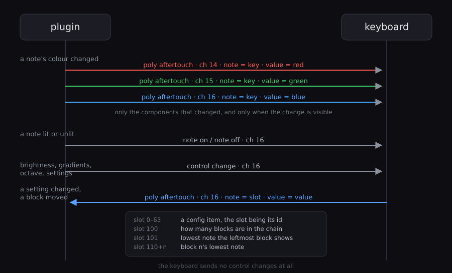

Gives every MIDI note its own colour on a ROLI LUMI Keys, from inside your DAW.

The factory firmware offers two colours and a scale mask. LumiPaint replaces the program
running on the keyboard with one that holds a full 128-entry colour table, then drives it
from a CLAP plugin: paint notes by hand, generate a scale, animate them, or read the
colours straight off another plugin's on-screen keyboard and mirror them onto the
hardware.

Two halves, and you need both:

- **`device/lumi_paint.littlefoot`** runs on the keyboard. It owns the LEDs, holds the
  colour table, and sends MIDI from the keys. Flashing it **replaces ROLI's program**;
  Dashboard's factory reset puts theirs back.
- **`src/`** builds the plugin. It decides what colour every note should be and keeps the
  keyboard in step.

---


**Contents** — [What it runs on](#what-it-runs-on) · [Setting it up](#setting-it-up) ·
[The editor](#the-editor-control-by-control) · [Several instances](#several-instances) ·
[Chained blocks](#chained-blocks-joined-or-independent) ·
[The wire protocol](#the-wire-protocol) · [Porting](#porting) · [Known limitations](#known-limitations)

---

> **Flashing the device program replaces ROLI's own.** Your keyboard will stop
> behaving the way Dashboard expects until you load a factory program back onto it.
> Dashboard's factory reset does that. Nothing here is permanent, but do not flash a
> keyboard you are about to rely on in front of people.

## What it runs on

Tested on **LUMI Keys** and **Piano M**, single and chained in pairs. Firmware 1.3.0 or
later, which is what Dashboard needs to accept a Littlefoot program at all.

Larger ROLI pianos are untested. **How to test on larger ROLI pianos** below says what
would need changing and how to find out in one flash.

## Setting it up

**macOS:** the [latest release](../../releases/latest) has both plugin
formats built for macOS (Contribution from **Lluis Gerard**) and the device program, so nothing needs compiling.
unzip the Mac package and double-click **Install LumiPaint.app**.
The app runs setup directly without opening Terminal or loading your interactive
shell configuration. It contains all payloads, so moving the app does not break
installation. From a source checkout, build into `build-macos` first using the
commands below, then run `./packaging/macos/package-macos.sh` to create the app.
The installer validates the signed bundles, installs VST3 and CLAP into your
user Library, and backs up any previous installation. It keeps the device file at
`~/Library/Application Support/LumiPaint/lumi_paint.littlefoot`.

Setup then opens ROLI Dashboard and reveals that file in Finder. **Drag the file
onto the keyboard's picture in Dashboard to load the onboard program.** This
manual device step is still required: neither the Mac nor Windows installer uploads
Littlefoot automatically. Opening Dashboard or copying the file is not proof that
the device has loaded it. Expect a dim rainbow after the upload.

To assemble a Mac download after building, run `./packaging/macos/package-macos.sh`. It creates a
folder and ZIP under `release/`, including the installer, both plugins, Littlefoot,
license and setup instructions. These are locally signed development builds;
they are not notarized for public distribution.

If macOS blocks the download, attempt to open it, then check **System Settings >
Privacy & Security > Open Anyway**, following [Apple's instructions](https://support.apple.com/102445).
The plugin may also need approval before rescanning it in Live. You can cancel
the Dashboard step after the plugins are installed to test loading without
replacing the keyboard program.
If Dashboard cannot open, setup displays instructions for installing it through
ROLI Connect and confirms that plugin installation has completed. A keyboard
that already has the LumiPaint program does not need another upload.

For a preflight without installation, use `./packaging/macos/install-macos.command --check`.
`--install-only` skips the dialogs and Dashboard handoff; close DAWs before using
it. The installer tests (`bash tests/macos_installer_test.sh`) use temporary
Library folders and never access the keyboard.
To test the packaged app, run `bash tests/macos_launcher_test.sh "/path/to/Install LumiPaint.app"`.
This checks a relocated app, paths containing spaces and apostrophes, installation
to a temporary Library, and independence from Bash startup hooks.

**Windows:** the [latest release](../../releases/latest) has both plugin
formats built for Windows and the device program, so nothing needs compiling.

Unzip the whole thing into a folder and double-click **`install-windows.bat`**. It copies
both plugin formats into your per-user plugin folders — no administrator prompt, because
those locations belong to you and every host scans them.

`uninstall-windows.bat` removes them again.

If you would rather do it by hand:

| File | Where it goes |
| --- | --- |
| `LumiPaint.clap` | `%LOCALAPPDATA%\Programs\Common\CLAP\` |
| `LumiPaint.vst3` | `%LOCALAPPDATA%\Programs\Common\VST3\` |
| `lumi_paint.littlefoot` | not installed — dragged onto the keyboard in ROLI Dashboard, see below |

`LumiPaint.vst3` is a **folder**, not a file. Copy the whole thing, and if your host does
not list it, check that `LumiPaint.vst3\Contents\x86_64-win\LumiPaint.vst3` is inside —
a copy that missed the nested file leaves a bundle that looks right and cannot load.

Rescan plugins in your host afterwards.

Then follow the steps below. **Step 2** is building from source and is the only one you
can skip; the keyboard still has to be flashed before any of this does anything.

**0. Check the firmware.** The keyboard needs **1.3.0 or later** for Dashboard to accept
a Littlefoot program at all. Dashboard shows the current version and updates it. On
older firmware the drop is refused or silently does nothing, and no amount of fiddling
with the program will change that.

**1. Flash the keyboard.** Open ROLI Dashboard and drag `device/lumi_paint.littlefoot` onto
the picture of your keyboard. Dashboard can stay open afterwards — it and the plugin can
hold the port at the same time.

You should see a dim rainbow across the keys straight away. That is the program's default
map, and it means the flash worked.

### CPU

The plugin is close to free when its window is closed - a tenth of a percent of one core -
and almost everything it costs with the window open is the editor redrawing. So the editor
does not redraw unless something has changed.

Two things decide that. The host notices input, because it has to: ImGui applies queued
input inside `NewFrame`, so an editor that skipped a frame would never learn the pointer had
moved and could never wake itself up. The editor notices everything else by folding the 128
colours into one number and comparing it with last frame's, which covers notes arriving,
effects decaying and a zone's colours changing without needing to know which happened.

An editor sitting open with nothing playing and the mouse still costs about four percent of
a core instead of sixty-six. Move the pointer and it redraws at full rate, as it must.

What this does **not** do is redraw only the part that changed. An immediate-mode editor has
no retained widgets to leave alone - every frame rebuilds the whole interface - so a change
anywhere redraws everything. While notes are playing or a screensaver is running the colours
change on every tick, and the saving above does not apply.

Those redraws are capped at thirty a second instead of sixty, which halves that case and is
as much as anyone can see of a keyboard mirror. Input is deliberately not capped, because a
pointer at thirty frames feels worse than one at sixty and input frames are rare. The device
is fed from the worker at its own rate throughout and never waits for the editor; only the
picture of it slows down.

Measured on the audio thread, `process` takes well under a microsecond against a ten
millisecond block, so none of this was ever about the DAW's own deadline - it was about not
spending a core on drawing the same picture sixty times a second.

## Building it yourself

**2. Build the plugin.**

#### Windows

**This is the tested path.** It uses MSYS2, which provides the compiler and the shell.

**Install MSYS2** from [msys2.org](https://www.msys2.org) and run it once to let it
update itself.

**Open the right shell.** MSYS2 installs several, and they are not interchangeable: from
the Start menu choose **MSYS2 MinGW 64-bit**, not *MSYS2 MSYS*. In the wrong one the
compiler is on the path but cannot run, and the error it produces says nothing useful —
a failed compile with no compiler message at all.

**Install what is needed**, in that shell:

```sh
pacman -S --needed mingw-w64-x86_64-toolchain mingw-w64-x86_64-cmake \
                   mingw-w64-x86_64-ninja mingw-w64-x86_64-make git
```

The toolchain is the compiler. CMake, Ninja and Make are for the VST3 step, which hands
over to [clap-wrapper](https://github.com/free-audio/clap-wrapper); the build tries each
generator in turn, so having more than one is deliberate. Git fetches the dependencies.

**Fetch the dependencies and build**, from the project folder:

```sh
git clone --depth 1 https://github.com/free-audio/clap.git clap-src
git clone --depth 1 -b v1.91.5 https://github.com/ocornut/imgui.git imgui
git clone --depth 1 -b 6.0.0 https://github.com/thestk/rtmidi.git rtmidi
sh build_gui.sh
```

That builds the CLAP and then the VST3, so the two cannot drift apart. The VST3 comes
from clap-wrapper rather than a second implementation; its first run also downloads the
VST3 SDK and needs a network, and takes a few minutes.
`LUMIPAINT_NO_VST3=1 sh build_gui.sh` skips it when you are iterating on the CLAP.

**Install them:**

```sh
cp LumiPaint.clap "$LOCALAPPDATA/Programs/Common/CLAP/"
cp -r build-vst3/Release/LumiPaint.vst3 "$LOCALAPPDATA/Programs/Common/VST3/"
```

The VST3 is a folder rather than a file, hence `-r`. That is the same per-user location
`install-windows.bat` writes to, so neither path needs an elevated shell.

**Keep the project path free of spaces.** The wrapper build does not handle them and the
script refuses early rather than failing obscurely later.

#### macOS and Linux

Both use CMake. The Apple silicon CLAP and VST3 builds have been compiled. The
VST3 passes instance initialization, stereo bus negotiation, MIDI port and bundle
signature checks. Loading the editor and switching desktops/background apps have
also been tested in Ableton Live 12.4.5 on Apple silicon with macOS 26.5.2. Hardware
lighting, full MIDI routing and screen capture remain unverified. Linux remains untested.

macOS:

```sh
cmake -B build
cmake --build build
cp -r build/LumiPaint.clap ~/Library/Audio/Plug-Ins/CLAP/
```

`LUMIPAINT_HOST_SOURCES` no longer needs spelling out — each platform has one sensible
answer and CMake picks it. The result is a bundle, not a file, hence `cp -r`. Universal
by default; `-DCMAKE_OSX_ARCHITECTURES=arm64` builds for Apple silicon alone.

For **Ableton Live on Apple silicon**, build the VST3. On a fresh checkout, fetch
the three dependencies first (skip any already present):

```sh
git clone --depth 1 https://github.com/free-audio/clap.git clap-src
git clone --depth 1 -b v1.91.5 https://github.com/ocornut/imgui.git imgui
git clone --depth 1 -b 6.0.0 https://github.com/thestk/rtmidi.git rtmidi
cmake -S . -B build-macos -DCMAKE_BUILD_TYPE=Release \
  -DCMAKE_OSX_ARCHITECTURES=arm64 \
  -DLUMIPAINT_BUILD_VST3=ON -DLUMIPAINT_BUILD_AU=OFF
cmake --build build-macos --parallel 6
mkdir -p ~/Library/Audio/Plug-Ins/VST3
cp -R build-macos/LumiPaint.vst3 ~/Library/Audio/Plug-Ins/VST3/
```

The first configuration also downloads the wrapper and VST3 SDK. The VST3 embeds
its own CLAP bundle, so Live needs only `LumiPaint.vst3` installed. This build is
for native Apple silicon Live; use `x86_64` for Intel or `"arm64;x86_64"` for a
universal build. Those other architectures have not been verified here.

Enable VST3 system folders in Live's plug-in settings and rescan. To pass notes
through LumiPaint to an instrument, put LumiPaint on one MIDI track and the
instrument on another. On the instrument track, select the LumiPaint track under
**MIDI From**, select LumiPaint in the lower chooser, and set **Monitor: In**.
This follows [Ableton's VST MIDI-output routing instructions](https://help.ableton.com/hc/en-us/articles/209070189-Accessing-the-MIDI-output-of-a-VST-plug-in);
The full MIDI routing setup still needs verification in Live.

LumiPaint exposes a silent stereo output for compatibility with Live's instrument
hosting. Sound comes from the instrument on the receiving track. Earlier macOS
builds exposed no audio ports: Live 12.4.5 scanned them successfully but refused
to load them with "No valid output bus could be found" in its log. If you installed
that build, quit Live, replace the VST3 with the rebuilt bundle and rescan.

After building, run `sh tests/run-macos-tests.sh` to check VST3 initialization and
bus negotiation, both MIDI ports, silent float/double output buffers and signing.
The tests do not activate the plugin's MIDI worker or send anything to hardware.

The Mac regression suite also checks app focus changes with multiple editors,
text input and notifications after editor destruction. A Live 12.4.5 crash
was traced to `ImGuiIO::AddFocusEvent(false)` when Live moved into the
background. ImGui 1.91.5's Cocoa callbacks used the current global context and
left observers registered after shutdown. CMake now applies the tracked
`cmake/imgui-osx-context.patch` to a build-local backend copy to bind callbacks
to their editor and clean up observers. The original backend reproduces the
null-context crash; the patched backend passes the regression. After installing
the fix, the tester also reported using other apps and switching desktops before
returning to Live without another crash.

Choose the LUMI USB port in LumiPaint's editor. The lighting connection is direct
from the plugin to the keyboard. Lighting requires the Littlefoot program from
step 1; building or installing the plugin does not load that program onto the device.

Linux:

```sh
./build-linux.sh --install
```

That fetches the three pinned dependencies, checks you have the headers it needs,
builds, and copies the result into `~/.clap`. Add `--vst3` for the VST3 wrapper as
well, drop `--install` to leave it in `build/`. If a header is missing it prints the
package names for Debian, Fedora and Arch rather than failing in the compiler.

By hand, if you would rather:

```sh
./fetch-deps.sh
cmake -B build -DCMAKE_BUILD_TYPE=Release
cmake --build build
cp -r build/LumiPaint.clap ~/.clap/
```

X11 and GLX, not Wayland — that is what CLAP's linux API hands over. Under XWayland it
works; under a pure Wayland session it does not.

To check the editor actually opens without a DAW:

```sh
cc -Iclap-src/include tests/linux_gui_smoke.c -o smoke -ldl -lX11
xvfb-run -s "-screen 0 1400x960x24" ./smoke build/LumiPaint.clap
```

That is a minimal CLAP host: it loads the module, creates the plugin, parents the
editor into a real X11 window and renders frames. It is what CI runs.

Linux needs `libx11-dev`, `libgl1-mesa-dev` and `libasound2-dev`, and X11 — under a
native Wayland session the editor will not embed and the capture cannot work at all,
since one client reading another's surface is what Wayland exists to prevent. XWayland
is fine. File dialogs use `zenity` or `kdialog` if either is installed; without one, maps
have to be loaded by path.

On macOS, reading another application's window needs Screen Recording permission, granted
once in System Settings. The first attempt fails and the system prompts, and the host has
to be restarted before it takes effect.

Add `-DLUMIPAINT_BUILD_VST3=ON` to either for a VST3, and on macOS an AU as well. Those
come from [clap-wrapper](https://github.com/free-audio/clap-wrapper), which turns the
finished CLAP into the other formats — so one set of sources serves all of them and a
fix cannot land in one and miss another.

### In your DAW

**3. Load LumiPaint on a track**, before the instrument. It is a note effect: notes pass through
untouched, and sitting ahead of the instrument is what lets the capture feature play a
note into the plugin it is reading.

**4. Choose the keyboard** in the combo at the top of the editor. `Auto` takes the first port
whose name looks like a ROLI keyboard — LUMI, Piano M, or anything with ROLI in it —
which is wrong the moment you own two, so pick yours explicitly. The choice is saved with the project.

If the keys look black, raise **Unlit level** — it defaults low so that played notes stand
out, which is too dark for looking at a static map.

---

## The editor, control by control

### Top bar

| Control | What it does |
| --- | --- |
| Port combo | Which MIDI output is your keyboard. `Auto` takes the first port whose name looks like a ROLI keyboard — LUMI, Piano M, or anything with ROLI in it, matched without regard to case. Stored by name, not index, so adding another device does not repoint it. |
| `Hold` | Keeps the keyboard on this instance instead of letting whichever track you play take it. See *Several instances*. |
| `Key width` | How wide the on-screen keys are drawn. Display only. |
| `Range` | Which notes the on-screen keyboard shows. Display only — the hardware window is marked by the green bracket beneath. |

The keyboard drawing shows the composited result, animations included, so it is a live
preview of the hardware. Keys outside the bracket are dimmed: no connected block can show
them.

### Colour

Paint the 128-note table by hand.

| Control | What it does |
| --- | --- |
| Picker | The colour everything in this section applies. |
| `Single note` / `All octaves` | Whether clicking a key selects just it or every octave of that pitch class. |
| Note field, `Set this note` | Colour one note by number, without hunting for it on screen. |
| `Apply to N pressed notes` | Paint the picker colour onto whatever you are holding down, and leave those notes selected. The count is live and the button is disabled when nothing is held. Because it also sets the selection, you can hold a chord, press this once, then move the picker and use `Apply to sel.` for each colour without replaying the chord. While `Incoming` is on a held key shows the highlight colour rather than its own, so the paint lands but is not visible until you let go — the button says so when that is the case. |
| `Apply to sel.` | Paint the picker colour onto the selected notes. |
| `Pick from sel.` | Load the first selected note's colour back into the picker. |
| `Fill unsel.` | Paint everything *except* the selection. One note red and the other 127 blue is two clicks. |
| `Invert sel.`, `Select all`, `Select none` | Selection, by button rather than by keyboard. |
| `Save...` / `Load...` | Saves the whole look of an instance to a file: the 128 note colours, every effect colour, and the settings that go with them — which effects are on, ripple speed and trail and colour source, afterglow decay, degree and tension strength, the screensaver pattern and its delay, brightness and unlit level. Not the port, the octave or anything else particular to this keyboard on this day, so a map opens the same on someone else's chain. Readable text, saved wherever you like; the dialog starts in Documents/LumiPaint but nothing depends on that. |
| `Copy` / `Paste` | Copy the whole look to every other LumiPaint on the machine, and paste it into one. The payload is exactly what a map file holds, so a setting that saves is a setting that copies. Paste is greyed out until something has been copied. Goes through LumiPaint's own shared memory rather than the system clipboard — putting plugin state over whatever you had in there would be rude. |

### Selecting keys

Most of the painting above acts on a selection, so this is worth knowing first. Hovering
any key shows the whole legend on its tooltip: it is the one place you are already
looking when you want to know what a click will do.

| On the keyboard | What it does |
| --- | --- |
| Click | Selects that key alone. With `All octaves` set, every octave of its pitch class. |
| Shift-click | Extends the selection from the last key clicked. |
| Ctrl-click | Adds or removes one key, so a scattered selection can be built by hand — every C, say — and a misclick taken straight back out. **Cmd-click on macOS.** |
| Ctrl-A | Selects all 128 keys. **Cmd-A on macOS.** On Windows it applies only while the pointer is over the editor, so the DAW keeps its own select-all the rest of the time. |
| Alt-drag | Paints with the picker colour as you go. Not selection — the one modifier here that changes colours rather than what is chosen. |

A selection does not have to be a range. `Paint n` in the Gradient section spreads the
stops across whatever is selected by position rather than by note number, so a scattered
selection gets the whole gradient end to end.

### Undo

`<` and `>` in the top right corner, thirty steps.

They cover the painted colours and only those: the generators, the gradient, apply to
selection, alt-drag painting, importing a captured keybed, loading a map, pasting
settings. An alt-drag across two octaves is one step rather than ninety — the snapshot
is taken when the drag starts, not per key.

Effect settings and output levels are deliberately outside it. Each is one control and
trivially put back by hand, while a colour table is 128 decisions; an undo that moved
sliders you never touched would be worse than none. Both arrows grey out when there is
nothing to go back to, and the tooltip says how many steps are left.

### Gradient

A gradient of up to eight colour stops, painted across a selection rather than onto one
note at a time. Select keys — see *Selecting keys* above — then press `Paint n`, and the
stops spread evenly across them: deep blue at the bottom through to red at the top, or
whatever you build.

| Control | What it does |
| --- | --- |
| Colour swatches | One per stop. Click to edit. |
| `n stops` | How many stops are in use, two to eight. |
| `Reverse` | Flips the order, so a gradient built low-to-high can be dropped high-to-low without rebuilding it. |
| `Paint n` | Spreads the gradient across the selected notes. Disabled with nothing selected. |

Spread by position in the selection, not by note number — select every C and you get one
stop per octave rather than a gradient squeezed into the span and sampled every twelve
notes. The strip above the swatches is drawn by the same function that does the
painting, so what you see is what lands on the keys.

The gradient is saved with the instance, written into map files, and carried by `Copy`,
so one built on a single track can be pasted across a whole project.

It is not only for painting: `Gradient` is also a ripple colour source, which is the one
source that reads nothing from the painted map. That makes it the way to get coloured
waves over a blacked-out keyboard.

### Modes

Four ways to fill the whole colour table at once. Each overwrites everything, so run one
first and paint individual notes afterwards.

| Mode | What it does |
| --- | --- |
| `Wheel` | Hue by pitch class, so every C is one colour and every F# another. |
| `Fifths` | Hue by position in the circle, so harmonically related keys sit near each other. |
| `Piano` | White keys white, black keys off. |
| `Blackout` | Everything off, as a starting point for painting by hand. |

Below them is the scale, which is a different thing: it colours the table by a key rather
than by a pattern, and it is also what Degrees and Tension measure against.

| Control | What it does |
| --- | --- |
| `Root` / `Scale` | The key. 63 scales in 8 groups; changing either recolours immediately. |
| Root / In / Out swatches | The three colours a scale uses: the tonic, the notes in the scale, the notes outside it. |
| `Reapply` | Repaint with the current scale and colours, after changing a swatch. |
| `Select in-scale` | Select the notes of the scale instead of painting them, so you can then paint them yourself with anything from the Colour section. |

### Lighting

| Control | What it does |
| --- | --- |
| `Brightness` | Overall LED brightness. |
| `Unlit level` | How bright a key is when nothing is happening on it. Low values make played notes stand out; raise it to read a static map. |
| `Send rate` | How hard to drive the link. `automatic` follows how many blocks are connected: one block is on USB and takes a hard drive, a chain has to feed its second block over the relay. Raise it by hand if your chain copes. |

### Sounding notes

What a key looks like while it is playing.

| Control | What it does |
| --- | --- |
| `Incoming` | Notes arriving from the DAW use this colour rather than their own. |

**Showing an arpeggiator, or anything else downstream.** An arpeggiator has to sit *after*
LumiPaint — in front of it, every instance's notes would be arpeggiated together instead of
each track's own — and nothing downstream ever passes back through the plugin, so those
notes are invisible to it.

The way round it is a virtual MIDI cable. Send the arpeggiator's output to a loopback port
(loopMIDI on Windows, an IAC bus on macOS, ALSA's virmidi on Linux) and point LumiPaint's
`Listen` selector at that port.

Those notes are watched, not received. They light the keys through `Incoming` and do
nothing else: they never re-enter the MIDI chain — the listen port is an input and nothing
from it is ever pushed to the plugin's output — and they do not claim the keyboard, start a
ripple, trigger afterglow or touch the sustain bookkeeping. An arpeggiator can run for
minutes with nobody touching the track, and letting that take the device would mean
whichever track had an arp going quietly won every argument about who owns the keyboard.
Showing is not playing.

In a shared chain they are filtered by zone like everything else, so each track's arpeggio
shows only on the keys that track owns.
| `Pressed` | Keys you are physically holding use this colour. Wins over `Incoming`, so a played note still reads over a busy sequence. |
| `Pressure` | Blends toward this colour as you press harder. |
| `Bend` | Blends toward this colour as a note bends, and lifts the key past the brightness ceiling so bend is brighter than everything else. |
| `Bend full-scale` | How much bend counts as maximum, in units of 64. A LUMI key bends about 170 units of the 14-bit range, so the default of 2 saturates on a full slide. Lower is more sensitive. |

### Auto-detection of coloured keys in a plugin

Read another plugin's on-screen keyboard and copy its colours onto the hardware.

This is what it was built for. **Kontakt** and **Falcon** colour their keyboards to show
what the keys do — keyswitches, articulations, drum maps, mapped ranges — and that
information lives inside the plugin window with nowhere else to go. Reading it puts those
same colours under your fingers, so you can see where the articulations are without
looking at the screen. Also works with DecentSampler, SINE Player and Chromaphone.

Little use on a plugin that draws a plain piano: there is nothing to copy.

| Control | What it does |
| --- | --- |
| `Find windows` | List what is open. |
| `Read keyboard` | Capture the chosen window and find its keybed. The status line reports keys, octaves, and pixels per white key. |
| `Find anchor` | Plays note 60 (C3) into the plugin and watches which key changes — that key is that note, and the anchor follows. Needs the plugin to show played notes on its keybed, and LumiPaint to sit ahead of it on the track. |
| `Lowest C is` | Which MIDI note the leftmost detected C is. Set by `Find anchor`, or by hand. Moving it re-places the captured colours straight away and clears the span they were at, whether `Live` is on or not. |
| `Import colours` | Write what was read into the colour table. |
| `Live` | Keep re-reading those keys and pushing the colours, about five times a second. Detection is not repeated, so this is one capture and a few hundred pixel reads. It keeps running with the LumiPaint window closed, and if the plugin being followed is closed and reopened it finds the window again by title. |

### Degrees

The last note played becomes the root, and every key is coloured by its interval from it,
snapped to a scale shape. Play a different root and the keyboard recolours, so modulation
is visible rather than something to work out.

| Control | What it does |
| --- | --- |
| Enable | On or off. The current root is shown beside it. |
| `Strength` | How much it covers what is underneath. Low values keep a captured map readable through it. |
| scale | Follows the root and scale set in Modes, with nothing to press. Membership is measured from the key, so the same seven notes stay lit whichever of them you play; the colours are measured from the note you played, which is what changes as you move around inside the key. |
| Slots 1–7, `chr` | A colour per scale degree, and one for anything chromatic. |
| `Tension by circle-of-fifths distance` | Colours each key by how far it sits from the root around the circle of fifths: warm at home, cool at the tritone, which is as far as anything gets. |

It sits above the painted or captured colours and below the transient effects, so ripples
and afterglow still read over it.

### Display effects

| Control | What it does |
| --- | --- |
| `Ripple` | A struck key sends a wave along the keybed. `Speed` is how fast, `Trail` how many keys it keeps burning behind the front. Twelve can run at once. |
| ripple colour | Where a wave takes its colour, worked out once when it starts. `Fixed` is the swatch. `Wheel` is hue by pitch class, `Fifths` hue by position in the circle of fifths, so harmonically close notes throw similar waves. `Degree` uses the degree colour of the note played. `Map` carries the colour of the key it came from, which over an imported keyswitch layout means a switch throws a wave in its own colour. `Gradient` takes the paint gradient by where the note sits across the keys the device is showing — low notes from one end, high notes from the other. It reads nothing from the map, so unlike the others it still gives coloured waves over `Blackout`, and over `Wheel`, `Fifths` or `Piano` the wave no longer matches the key it came from and is far easier to follow. |
| `Afterglow` | A struck key holds this colour and fades back over `Decay`. Brightness follows velocity. |
| `Beat pulse` | Flashes on the beat, brighter on the downbeat, from the host transport. Nothing happens when the transport is stopped. |
| `Chord halo` | With two or more notes held, the same pitch classes light in the other octaves. A single note is ignored. |
| `Splash` | A chosen CC fires a wave from the middle of the instrument, brightness scaled by its value. Throttled, so a CC sweep pulses rather than flooding. The origin is taken from the blocks themselves, not from the MIDI range: one block splashes from its own centre, a chained pair from the join between them. Blocks given their own octaves are handled too — the midpoint can then fall in the gap between them, so the wave arrives at each block's inner edge at the same moment and the pair lights symmetrically. |
| `Sustain` | Shows what the pedal is holding. A note released while CC 64 is down stays lit, because it is still sounding, and carries the sustain tint so you can tell it from a key under your finger. The whole sustained chord goes out together when the pedal rises, which is what makes a pedal lift visible. Off by default — the pedal changing the picture is a surprise unless it was asked for. |
| `Bend path` | Bend a key and the notes between it and the pitch you are bending to light up, brightest at the target. One path per held note, so a bent chord draws all of them. Needs `Send pitch bend` on in Keybed. |
| `Bend gradient` | Tints a sounding key by how far it is being bent. Under MPE each note is on its own channel, so each is tinted by *its own* bend — leaning on one note does not colour the rest of the chord. The tint is computed in the plugin rather than on the device, because the firmware keeps a single incoming bend value and applies it to every key the host lit; that was fine for one bend wheel and wrong for everything MPE is for. |
| `Velocity brightness` | A held key's brightness follows how hard it was played. Needs `Incoming` and `Pressed` off, since those are applied on the device and override it. |

All of these are computed in the plugin and composited over the colour table, so they work
over an imported map.

### Screensaver

The clock counts only while nothing is lit. Holding a chord is not idleness — a held key
sends one note-on and then nothing, so a timer that watched for arriving notes would run on
underneath it and bring the screensaver up over keys that were still down. Notes the pedal
is holding and notes seen on the listen port count too: an arpeggiator running is the music
playing, whoever is touching the keyboard.

Runs when nothing has been played for the delay set beside it, and stops the instant a note
arrives. It sits apart from the display effects because everything there reacts to playing
and this one only runs when nothing is.

| Pattern | What it does |
| --- | --- |
| `Waves` | Slow swells along the keybed, deep navy through blue to a pale crest. Two swells of different length and speed, so it never settles into an obvious repeat — one alone reads as a metronome. |
| `Aurora` | Hue drifting along the keyboard rather than brightness: everything lit, nothing blinking. Green through teal and blue to violet; the full hue circle would bring the keyboard round to amber, which reads as a fault rather than an aurora. A cycle spans about forty keys, so a two-octave block shows roughly half the palette at once and neighbouring keys are always close in colour. |
| `Breathing` | Your painted colours, swelling up and down together. The map is kept, not replaced, so an imported keyswitch layout stays readable while the keyboard is idle. It is sent as a single controller message rather than by repainting the keys — the device already has an unlit level, and this swells it — so it costs no note bandwidth at all and a key under your finger stays at full brightness while everything around it breathes. It scales the `Unlit level` you set rather than overriding it, so that slider stays the ceiling. |
| `Ember` | The same swell with a per-note phase offset, so the map shimmers rather than pulsing as one slab. A hundred and twenty-eight different phases cannot be one controller value, so unlike `Breathing` this one does repaint the keys and costs what the other patterns cost. |
| `Gradient drift` | Your paint gradient scrolling along the keybed. The only pattern whose palette is yours rather than chosen for you — change the gradient and the screensaver changes with it. The stops are read as a loop, so the last blends back round to the first and the drift travels one way for ever with no seam. |
| `Rainfall` | Drops landing and fading, nothing else lit. Each drop splashes two keys either side as it lands, a fraction later and a third dimmer per key out, so it reads as spreading from where it fell rather than five keys switching on at once. Where two drops overlap the keys between them carry both colours, averaged by how strongly each arrives and brightened by the sum — the way two crossing ripples do. Drops fall every three to ten seconds per key, and the fade is stepped rather than smooth — a splash covers five keys, so drops at the rate single keys used to fall put most of the keyboard in motion at once, and a smooth decay rewrites every lit key on every tick for a shade nobody can see. Together those are four times less traffic to the device for the same pattern. Each key keeps its own interval and its own colour from the gradient, so the keyboard has a consistent character rather than flickering through the whole palette. Looks best over `Blackout`. |

`Waves`, `Aurora`, `Gradient drift` and `Rainfall` replace the colour table until a note
is played. `Breathing` and `Ember` keep it and move only its brightness, never all the way
to black — a map that went dark and came back would
read as the plugin dropping out. The panel says which kind you have chosen.

### Keybed

Settings that live on the hardware. Values are mirrored back from the device, so Dashboard,
the octave buttons and this panel always agree.

| Control | What it does |
| --- | --- |
| `Send pitch bend` | Whether sliding along a key sends bend. Still tracked when off, so the gradient works either way. |
| `Send pressure` | Whether pressure sends aftertouch. Same. |
| `Link octaves across the chain` | On, every block shifts together; off, each shifts on its own, which suits two blocks covering different registers. |
| `MPE` | MPE or single channel. |
| `Pitch bend range`, `Transpose`, `MIDI channel` | As in Dashboard. |

Dashboard also gains the full factory settings panel when this program is loaded:
sensitivity curves, fixed velocity, pitch bend range, tracking modes and brightness.

### Key mapping

| Control | What it does |
| --- | --- |
| `Octave` | Shifts notes and lights together. Follows the hardware buttons. |
| `Display offset` | Shifts what the lights show without moving the notes, for when something upstream transposes but the keyboard does not know. |
| `Fold octaves` | A lit note lights every key of its pitch class, so notes outside the visible window still show. |

Note names follow one convention throughout: note 0 is C-2, note 60 is C3, note 127 is
G8. It is not a setting. A setting for this can only ever be set wrong, and being wrong
looks exactly like the anchor being wrong.

---

## Sharing one chain

Several instances can divide one keyboard between them. Tick **Share the chain** and each
takes a range of notes; notes outside it are ignored by that instance, so every track
lights only its own keys.

Ticking `Share` in the top bar takes the largest stretch nobody else has, so a second or
third track joining an already-divided chain lands somewhere sensible rather than being
refused.

The ranges are drawn as bars directly under the keys they cover — yours highlighted,
everyone else's grey, and the one that is sending marked `master`. **Alt-drag along that
bar** to set this instance's range; direction does not matter, and a range that collides
turns red under the pointer rather than at the end of the drag. A range in the abstract
means nothing; what matters is which keys it covers, and the keyboard is right there.

**Where a zone's keys play is separate from where they are.** Under the zone bar is an
offset in semitones, and beside it a line reading `keys C4-B4 play C2-B2`. The keys are
where your hands go; the notes are what the track receives and what the colour map is
written in.

That is what makes a captured keyboard usable. A plugin whose keyswitches live at C2-B2
can be put under the keys at C4-B4 where you can actually reach them, and the colours
travel with it — the map belongs to the sound, not to the key positions. It also lets two
tracks be played the same notes from different parts of the keyboard: one octave driving a
bass, another driving a pad, both sending C2-B2 to their own track.

Semitones rather than octaves, because captured ranges are not whole octaves — C2 to E3 is
sixteen. The key range and the note range are always the same length; the offset is the
distance between them.

The hardware's `Octave` control is pinned while sharing, and says so. It shifts which notes
the device reports for a given key, which would move every zone's mapping underneath it at
once — one control quietly undoing what each instance was set to.

A zone is a share of the instrument as much as of the lights: notes outside it are not
passed on to whatever follows LumiPaint on that track, so four tracks splitting an
arrangement each play only their own range instead of four copies of the whole thing.
Only notes are filtered — pitch bend, pressure, the sustain pedal and everything else
carry on through, since they are not addressed to a key and dropping a pedal because of
a range would be worse than the problem it solves.

Ranges are in **note numbers**, not blocks or key offsets, so the octave buttons on the
hardware scroll the chain across your zones rather than moving them. Four instances can
cover all 128 notes with a single two-octave block and the buttons walk it along.

**Overlap is refused, not resolved.** Two instances lighting one key is a mistake, and the
moment to say so is when the second one asks — the strip turns the blocking range red and
the request is rejected.

A range outlives silence. Ownership of the keyboard expires in seconds, because it follows
activity and a dead owner must not hold the device; a range is a decision you made, and it
survives a track going quiet, being deactivated, or its editor being closed. It is given up
when the instance goes, and otherwise expires only after two minutes with nothing running
at all — long enough that no gap in a session touches it, short enough that a rebooted
machine does not come back to a table of ranges owned by nobody.

**The zoned instances are one claimant.** Activity on any of them keeps the group on the
keyboard; they do not take it from each other. An un-zoned instance that is played takes
the device outright and the group stands down — its zones are untouched, it simply stops
sending until it wins back, and then resumes exactly where it was.

The screensaver belongs to whoever is sending. One keyboard going idle is one picture, and
members each starting their own — on their own idle clocks, reset by whatever reached their
own zone — would have made several, with a seam at every boundary and a drifting pattern
restarting at each one. Members publish their maps as usual and the sender lays the pattern
over the whole assembled chain.

`Hold` and `Share` are mutually exclusive, and each greys the other out. Hold says this
instance keeps the whole keyboard whatever happens; Share says it takes a slice and leaves
the rest. Both at once is not a state with a meaning.

One instance sends for the group, chosen as the lowest live zone owner. Every member works
that out from the same table, so there is nothing to elect and nothing to hand over when
one closes.

**Ripples cross boundaries, and only the sender draws them.** A wave travels as an event
carrying the speed, trail and colour its own instance resolved; members post and draw
nothing, so a wave appears once rather than twice with the two halves drifting apart as
they age. The sender lays them over the assembled keyboard *after* every zone is in place,
which is what lets one cross from a range into its neighbour — including the sender's own,
since by that point its range is just another part of the picture.

Everything else stays inside the zone that owns it. Afterglow, halo, bend path and the rest
are properties of the keys they touch, and they arrive already painted into each member's
zone.

**Beat pulse is the exception that is chain-wide.** A bar is a property of the music, not of
a range, so switching the pulse on in any one instance flashes the whole keyboard rather
than one slice of it.

The one thing LumiPaint cannot do for you is make your DAW deliver MIDI to every track —
a plugin cannot arm its own track. Enable input monitoring on each track in the chain, or
only the armed one will light.

It can at least tell you when that has happened. An instance that has a zone, has received
nothing for a while, and can see that the other members *are* receiving says so in the
panel rather than leaving you with a stretch of dark keys that looks identical to a zone
set wrongly. It will not cry wolf: silence everywhere just means nobody is playing, and
there is a grace period after claiming so a freshly opened project does not warn on every
track before you have touched one.

## Several instances

There is one keyboard and you may have a LumiPaint on every track. Ownership follows
activity: receiving notes or opening the editor claims the keyboard, and the previous owner
closes its port. Since live MIDI reaches only the armed track, playing a track is what puts
that track's colours on the keyboard.

Instances share what the hardware is currently showing, so a handover sends only the keys
that differ rather than re-uploading all 128 — switching tracks changes a handful of keys
instead of half a second of wrong colours.

`Hold` pins the keyboard to one instance if you want a reference map to stay put.

It works the same on all three platforms. The claim lives in a small block of shared
memory — a named mapping on Windows, POSIX shared memory elsewhere — holding who owns
the keyboard, who is holding it, and what is currently on the keys. Since it is named
rather than tied to a process, it also arbitrates between two different hosts running at
once, not just two instances in one.

One thing to know on macOS and Linux: the shared block is named `/LumiPaintDeviceClaim`
and outlives the processes using it, as POSIX shared memory does. That is deliberate —
it is how a newly loaded instance learns what the keyboard is already showing — and it
is a few kilobytes. `rm /dev/shm/LumiPaintDeviceClaim` clears it on Linux if you ever
want to.

---

## Chained blocks, joined or independent

Two blocks physically clipped together are one keyboard as far as the hardware is
concerned: they form a cluster, and each can ask where it sits in it. Everything below
follows from that one fact.

### Where a block puts itself

Each block works out its own note range from its position in the chain:

```
topOctaveShift = (getClusterXpos() - (getClusterWidth() - 1) / 2) * 2   octaves
baseNote       = 48 + (octaveShift + topOctaveShift) * 12
```

Two blocks at the same octave setting sit exactly end to end — 48 keys, no gap, no
overlap, nothing to configure. Add or remove a block and the arrangement re-forms on its
own.

That much is always true. What the **Link octaves** toggle decides is only whether the
blocks share an octave.

### Linked

Pressing an octave button moves every block, and it does not matter which one you press.
The pair stays continuous whatever you do to it — 48 keys behaving as one instrument.

### Independent

An octave button moves only the block you pressed. Put the left-hand block in the bass
and the right-hand one two octaves above with a gap between them, or move them onto the
same notes so both devices show the same range.

### Seeing where the blocks are

The editor draws a bracket under its keyboard for each connected block, in its own
colour, marking the notes that block is showing. Linked, the brackets sit end to end.
Independent, they sit wherever you have put them — including on top of each other.

Each block reports its own position, so the brackets follow the hardware rather than
assuming a layout. They update as you press the octave buttons.

The plugin sends colours for all 128 notes regardless of where the blocks are, and lets
the hardware light the ones it can show. So a block is never dark because the plugin
guessed wrong about where it went.

## The wire protocol



Everything travels as MIDI on **channel 16**, so anything that can send MIDI can drive
the keyboard, not just this plugin.

### Plugin to keyboard

| Message | Meaning |
| --- | --- |
| poly aftertouch, ch 14/15/16 | red / green / blue of the note in the message |
| Note on/off | light / unlight a key |
| CC 106/107 `v` | brightness / unlit level |
| CC 108 `0/1/2` | clear colours / clear lit keys / restore the default wheel |
| CC 109 `v` | display offset in semitones, centred at 64 |
| CC 110 `0/1` | octave folding |
| CC 113/114/115, CC 116 | highlight colour, and on/off |
| CC 117/118/119, CC 85 | pressed colour, and on/off |
| CC 20–22, CC 26 | pressure gradient colour, and on/off |
| CC 23–25, CC 27, CC 32 | bend gradient colour, on/off, and full-scale |
| CC 28/29 | write a device config item: id then value |
| CC 43/44 | send pitch bend / send pressure |
| CC 47 | link octaves across the chain |
| CC 51 `0/1` | bend trail drawn on the device, off by default and unused by the plugin, which draws its own |
| CC 87 `v` | set the octave, centred at 64 |

Colours are poly aftertouch because each message has to name its own note: the
four-message form it replaced — select a note, then red, green, blue — was a
transaction, and losing one message on a chained block's relay put a colour on the wrong
key. Everything else is a control change, and there is no reason for it not to be: these
go down the plugin's own connection to the keyboard, never through the host, so they
cannot reach an instrument.

Colours are 7 bits per channel. Halve each byte, and the device expands with
`(v << 1) | (v >> 6)` so full white survives the round trip.

### Keyboard to plugin

Everything comes back as **polyphonic aftertouch on channel 16**, one message each, with
the note number acting as a slot rather than a pitch.

| Slot | Meaning |
| --- | --- |
| 0–63 | a config item changed: the slot is the item id, the value its new setting, signed items offset by 64 |
| 100 | how many blocks are in the chain |
| 101 | the lowest note the leftmost block is showing |
| 110 + n | block *n*'s lowest note |

These travel through the host's note chain to whatever comes next, which is why they are
not control changes: a CC carries nothing saying who sent it, so reports on CC were
indistinguishable from a real controller. Filtering them sometimes swallowed a pedal;
not filtering them let the keyboard modulate whatever was downstream. SysEx would be
cleaner still and Littlefoot cannot send it — `sendMIDI` takes three bytes at most.

The keyboard's own keys send poly aftertouch too, since that is how pressure travels, and
a key can land on channel 16 under MPE. Two things separate them, and a message must fail
both to be treated as a report: **pressure only ever concerns a note that is being held**,
which a report never does, and **a report always carries one of the known slots** above.
Neither test is enough alone, since poly aftertouch can legitimately arrive with no
note-on behind it.

When that fails it recovers. Slots 30 and 32 are watched config items and also notes F♯0
and G♯0 — hold one and a real report for that slot reads as pressure and is dropped. So
one watched item is re-sent on every pass and the chain reports repeat every eight
seconds, and anything missed returns within about fifteen.

Every block sends its own slot, so a chain reports one message per block. A block with no
route to the host hands the same values to its neighbours over the connector, and
whichever block can reach the host relays them.

---

## Releases

Tagging builds all three platforms and drafts a release with the binaries attached:

```sh
git tag v1.0.1
git push origin v1.0.1
```

`.github/workflows/release.yml` builds Linux, Windows and macOS in parallel, runs the
Linux editor smoke test, checks the macOS CLAP really is a bundle with a valid
`Info.plist`, and uploads everything to a **draft** release for you to look over before
publishing. Nothing is signed or notarized.

To try a build without committing to a tag, run the workflow by hand from the Actions
tab — same three builds, results left as artifacts, no release created.

Building the release in CI rather than locally means the binaries and the tag match.
They did not for v1.0.0: the attached zip was built by hand from a tree that had moved
on from the tag.

## Repository layout

```
src/                  the plugin: the same code on every platform
src/platform/win32/   the window and GL context on Windows
src/platform/macos/   window, screen capture and file dialogs on macOS
src/platform/x11/     the window and GL context on Linux
cmake/                the macOS build module, the bundle plist, the ImGui patch
packaging/macos/      the installer app and the script that assembles it
device/               the Littlefoot program that runs on the keyboard
tests/                macOS installer and VST3 tests
```

Only three things are platform-specific: opening a window, reading another
application's screen, and showing a file dialog. Everything else — the detector, the
colour engine, the wire protocol, the editor itself — is one implementation shared by
all three. `src/platform/macos/macos_bridge.h` is the whole contract between the plain
C++ and the Objective-C++; both sides include it, so a mismatch is a compile error
rather than something that links and then misbehaves.

`packaging/macos/` is kept out of `src/` because none of it is plugin code. CMake never
compiles `macos_installer_main.m`; `package-macos.sh` does, with a direct call to clang.

## Porting

`src/imgui_host.h` is the window and OpenGL contract: create, destroy, set parent, set
size, set scale, show, hide, plus a render callback the layer invokes when it wants a
frame, plus an after-frame callback for anything modal. There is an implementation per
platform under `src/platform/` — `win32/imgui_host_win32.cpp`,
`macos/imgui_host_macos.mm` and `x11/imgui_host_x11.cpp` — and `LUMIPAINT_HOST_SOURCES`
picks one. Anything else would need a fourth.

The after-frame callback is not decoration. A file dialog opened from inside `render` is
opened in the middle of a frame, and a modal dialog pumps its own message loop: the host
redraws its own windows on that thread while the plugin's GL context is still current and
its own window sits disabled. The DAW goes black and stops answering the mouse while the
editor sits frozen on its last frame, and nothing about that points at a file dialog.
Deferring inside `render` is not enough — it has to be after the frame, which only the
host layer can arrange.

The three are deliberately written to read side by side, because the awkward parts are
the same everywhere and only the spelling changes: not drawing a frame while a frame is
already open, which every platform reaches through some modal loop of its own; not taking
the keyboard from the host unless a text field is being edited; and starting to paint on
parent as well as on show, since a host that attaches the view itself never calls show.

Repaint is driven by the host layer's own timer rather than the CLAP timer extension: a
host that does not provide one would leave the window created and never painted.

---

## How to test on larger ROLI pianos

Only LUMI Keys and Piano M have been tried. A larger piano may work unchanged or may
need about twenty lines, and one flash tells you which.

**Find out first.** Flash `device/probe_ruler.littlefoot`. It lights each key with its
LED index, so the key count and the layout are visible directly, with no plugin
involved. Reflash `lumi_paint.littlefoot` afterwards.

**If it reports as a chain of 24-key blocks** it should work as it is. The topology code
already places blocks by their position in the chain and handles up to five, which
covers the whole usable MIDI range.

**If it is one block with more keys**, three things need changing in
`device/lumi_paint.littlefoot`:

1. Read the key count from `getNumKeys()` instead of the fixed `numKeys = 24`.
2. Size the per-key arrays to that count — `pressed`, `keyPressure`, `keyBend`,
   `keyChannel`, `keyNote`.
3. Derive `startNote` rather than assuming 48.

**One warning on the second of those.** Those arrays were 64 entries for a 24-key block
until the waste was noticed. Oversized arrays exhaust the device's heap, and when that
happens Littlefoot does not complain — Dashboard's settings panel silently shows nothing
at all, which looks like anything but a memory problem. Size them to the real key count;
do not simply make them large again.

The plugin needs no changes either way. It sends colours per MIDI note, and how the
hardware divides itself is the device program's business.

If you have a larger piano and try this, the result is welcome.

---

## Known limitations

- Keybed detection needs about 8 pixels per white key. Below that the black keys cannot be
  resolved and the result is confidently wrong rather than absent; the status line reports
  the measured width so it can be refused.
- A plugin drawn with OpenGL or Direct3D returns a black capture and cannot be sampled.
- The test that decides where a keyboard ends uses a fixed brightness threshold, so a
  very dark GUI can lose a few keys at the ends. Relaxing it costs accuracy elsewhere.
- Firmware 1.3.0 or later is required. Earlier versions have no way to accept a
  Littlefoot program, so nothing here can work on them.
- Windows has been tested with a host and keyboard. macOS and Linux share
  the core code exercised on Windows, with platform-specific window, capture and
  dialog implementations. Apple silicon CLAP/VST3 compilation, bundle metadata and
  VST3 instance initialization and bus negotiation have been checked. Editor loading
  and desktop/background switching have been tested in Live 12.4.5 on macOS 26.5.2.
  Hardware lighting, full MIDI routing and screen capture remain unverified, as do
  the AU, Intel and universal builds. Windows/Linux were not retested for these changes.
- The plugin reads the keyboard's own input port directly. On Windows that used to mean
  competing with the host for an exclusive port; Windows MIDI Services makes MIDI 1.0
  ports multi-client, so on Windows 11 with it installed both can hold the port at once.
  On an older setup the plugin falls back to listening through the host, which works as
  long as the track is armed.

---

## Licence

```
Copyright (C) 2026 Simon Bourdareau

LumiPaint is free software: you can redistribute it and/or modify it under the
terms of the GNU General Public License as published by the Free Software
Foundation, either version 3 of the License, or (at your option) any later
version.

This program is distributed in the hope that it will be useful, but WITHOUT ANY
WARRANTY; without even the implied warranty of MERCHANTABILITY or FITNESS FOR A
PARTICULAR PURPOSE. See the GNU General Public License for more details.
```

Anyone distributing a modified version has to publish their source
under the same terms.

The dependencies allow it - CLAP, Dear ImGui and RtMidi are permissive - and Steinberg's
VST3 SDK is itself dual-licensed GPLv3 or proprietary, so the VST3 build is on the GPL
side of that choice.

## Credit

The device-side protocol builds on the reverse engineering in
[benob/LUMI-lights](https://github.com/benob/LUMI-lights), and on ROLI's own Littlefoot
API, with `ConfigIds.littlefoot` and `StudioLightkeyScript.littlefoot` supplying the config
item numbers, the cluster topology formula and the key handling.
